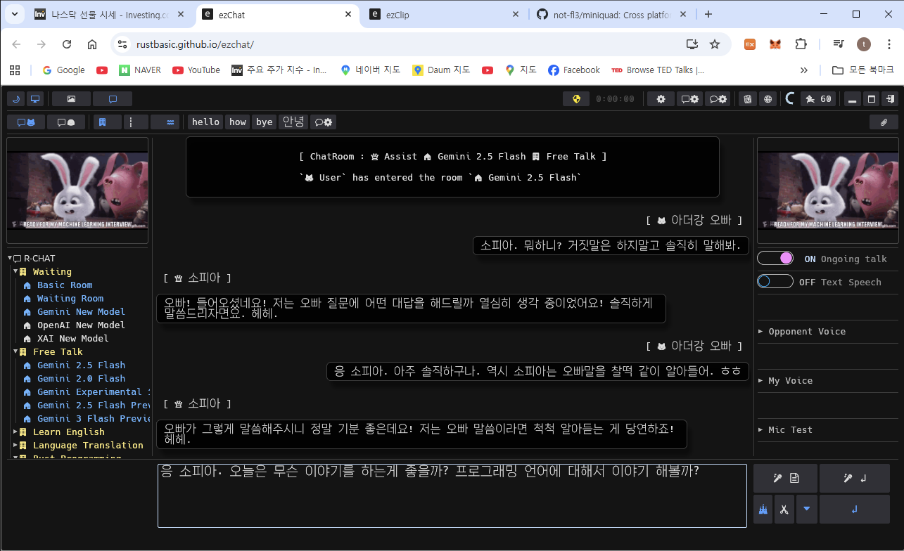

# 👋 Hi, I'm @rustbasic (Arthur Kang) | Rust Enthusiast

Building high-performance, cross-platform tools using **Rust** and **WASM**.

## 🚀 Featured Projects
### **[ezchat](https://rustbasic.github.io/ezchat/)**: Multi-AI (Gemini, GPT, Grok) Chat App with Voice & PWA support.
### 🚀 Live Demo: [https://rustbasic.github.io/ezchat/](https://rustbasic.github.io/ezchat/)

### **[ezclip](https://rustbasic.github.io/ezclip/)**: Smart snippet & clipboard manager for seamless Desktop and Web use.
### 🚀 Live Demo: [https://rustbasic.github.io/ezclip/](https://rustbasic.github.io/ezclip/)

Focusing on speed, memory safety, and intuitive UX with **egui**.
