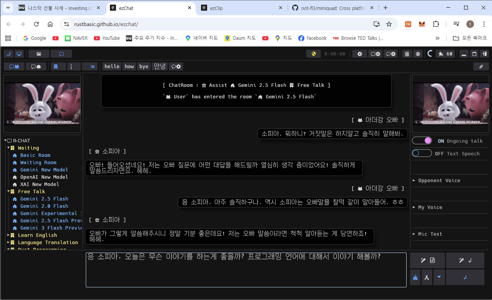

# 👋 Hi, I'm @rustbasic (Arthur Kang) | Rust Enthusiast

Building high-performance, cross-platform tools using **Rust** and **WASM**.

## 🚀 Featured Projects
### **[ezchat](https://rustbasic.github.io/ezchat/)**: Multi-AI (Gemini, GPT, Grok) Chat App with Voice & PWA support.

| Status | Primary Link | Mirror Link |
| :---: | :---: | :---: |
| **Stable** | [https://rustbasic.github.io](https://rustbasic.github.io) | [https://rustbasic.github.io/ezchat](https://rustbasic.github.io/ezchat) | 

### 🚀 Live Demo: [https://rustbasic.github.io/](https://rustbasic.github.io/)

Focusing on speed, memory safety, and intuitive UX with **egui**.
